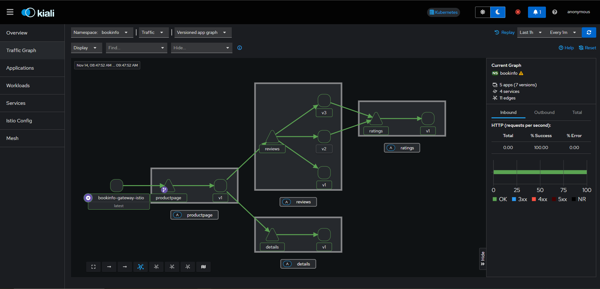

# Istio Traffic Management Lab - CKA Course

Este laboratorio práctico está diseñado para aprender a implementar estrategias de backup y restauración de etcd, un componente esencial en el control plane de Kubernetes. Asegúrate de seguir cada paso cuidadosamente y practicar varias veces para estar completamente preparado para el examen.

## Prerrequisitos

- **VirtualBox** (se necesita **Python** y **pywin32** como prerrequisitos).
- **Vagrant**.
- **MobaXterm** para sesiones SSH.

## Objetivos

1. Instalar y configurar Istio en un clúster de Kubernetes, habilitando la gestión de tráfico avanzada.
2. Activar la inyección de sidecars para gestionar el tráfico entre servicios.
3. Configurar un API Gateway de Istio para controlar el tráfico de entrada al clúster.
4. Aplicar reglas de **Request Routing** para dirigir el tráfico a versiones específicas de servicios.
5. Simular fallos mediante la **Fault Injection** (inyección de latencia y errores).
6. Implementar políticas de **Traffic Shifting** para dividir el flujo entre versiones.
7. Configurar **Circuit Breaking** para mejorar la estabilidad ante fallos.
8. Aplicar **Traffic Mirroring** para duplicar el tráfico hacia nuevas versiones para pruebas sin impacto en usuarios.
9. Configurar gateways de **Ingress y Egress** para gestionar tráfico externo.
10. Practicar técnicas básicas de solución de problemas en Istio.

## Contenido del Repositorio

Este repositorio incluye:

- Una carpeta `scripts` con dos scripts que proporcionan soporte durante el laboratorio.
- Un fichero `Vagrantfile` que permite automatizar el despliegue de tres VMs en VirtualBox.

Las VMs consisten en:

- 1 nodo master.
- 2 nodos worker.

## Paso 1: Despliegue de las VMs

1. Clona el repositorio en tu entorno local:

   ```bash
   git clone https://github.com/arol-dev/kubernetes-cka-istio-traffic-management.git
   cd kubernetes-cka-istio-traffic-management
   ```

2. Dentro del repositorio, ejecuta el siguiente comando para desplegar las VMs:

   ```bash
   vagrant up
   ```

   Esto comenzará a desplegar tres VMs en VirtualBox: un nodo master y dos worker nodes. Espera unos minutos para que el proceso termine.

3. Verifica el estado de las VMs con:

   ```bash
   vagrant status
   ```

   Asegúrate de que las tres máquinas estén en estado `running`.

4. Obtén la configuración SSH para conectarte a las máquinas:

   ```bash
   vagrant ssh-config
   ```

   Guarda los detalles proporcionados, ya que los necesitarás en el siguiente paso.

## Paso 2: Conectar a las VMs con MobaXterm

1. Abre **MobaXterm** y utiliza la configuración SSH obtenida anteriormente para conectarte a las tres máquinas.
   - No se requiere un usuario específico, deja el campo vacío.
   - Si se te solicita usuario o contraseña, utiliza la cadena `vagrant`.

## Paso 3: Instalación de Istio

1. **Descargar Istio**
    ```bash
    curl -L https://istio.io/downloadIstio | sh -
    ```
2. **Actualizar PATH env**
   ```bash
    export PATH="$PATH:/home/vagrant/istio-1.24.0/bin"
    ```

2. **Pre-check de la Instalación de Istio**
    ```bash
    istioctl x precheck
    ```

3. **Instalar Istio Usando el Perfil Demo**
    ```bash
    cd istio-1.24.0 && \
    istioctl install -f samples/bookinfo/demo-profile-no-gateways.yaml -y
    ```

### Contenido del Directorio istio-1.24.0 Descargado

Este repositorio incluye:

- La carpeta `/samples/bookinfo/gateway-api`, que contiene todos los *manifests* para desplegar y gestionar el tráfico utilizando las APIs de Gateway de Kubernetes. Incluye la definición del Gateway y varias HTTPRoute para configurar la gestión del tráfico.

- La carpeta `/samples/bookinfo/networking`, que contiene todos los *manifests* para desplegar y gestionar el tráfico utilizando las APIs de Istio. Incluye la definición del Gateway de tipo `gateway.networking.istio.io` y varios VirtualService para configurar la gestión del tráfico.

## Paso 4: Habilitar Istio en el Clúster

1. **Habilitar la Inyección de Istio en el Namespace bookinfo**
    ```bash
    kubectl create ns bookinfo && \
    kubectl label namespace bookinfo istio-injection=enabled
    ```

## Paso 6: Desplegar la Aplicación BookInfo de Istio

1. Despliega la aplicación:
   ```bash
   kubectl apply -f https://raw.githubusercontent.com/istio/istio/release-1.23/samples/bookinfo/platform/kube/bookinfo.yaml -n bookinfo
   ```

2. Verifica que los pods se hayan desplegado correctamente en el namespace bookinfo.
   ```bash
   kubectl get pods -n bookinfo
   ```

   Deberías ver que los pods muestran `READY 2/2`, lo que confirma que tienen su contenedor de aplicación y el contenedor *sidecar* de Istio.

3. Error: Si solo ves un contenedor por pod, reinicia el `coredns` (opcional):
   ```bash
   kubectl -n kube-system rollout restart deployment coredns
   ```

## Paso 5: Instalar el API Gateway (Kubernetes)

Los Kubernetes Gateway API CRDs (Custom Resource Definitions) son un conjunto de recursos personalizados que forman parte de la Gateway API en Kubernetes. Estos CRDs están diseñados para ofrecer un enfoque más flexible, extensible y controlado para gestionar el tráfico de red en Kubernetes, superando algunas de las limitaciones del recurso Ingress nativo. La Gateway API se enfoca en mejorar la administración de tráfico de entrada, como el enrutamiento, balanceo de carga, seguridad, y políticas de red avanzadas.

**Proceso de instalación de un Ingress Gateway**

La aplicación Bookinfo está desplegada, pero no es accesible desde el exterior. Para hacerla accesible, necesitas crear un *ingress gateway*, que mapea una ruta a un destino en el borde de tu *mesh*.

```bash
kubectl apply -f samples/bookinfo/gateway-api/bookinfo-gateway.yaml -n bookinfo
```

Este comando instala un Gateway de Kubernetes y un recurso HTTPRoute. Ejecuta el comando `kubectl get <tiporecurso> <nombrerecurso> -o yaml -n bookinfo` para ver la definición YAML de estos nuevos componentes de Kubernetes.

Ejecuta el siguiente comando:

```bash
kubectl get svc -n bookinfo
```

Deberías ver que Istio crea un servicio **LoadBalancer** para un gateway. Como accederemos a este gateway mediante un túnel, no necesitamos un balanceador de carga. Cambiamos el tipo de servicio a ClusterIP añadiendo una anotación al gateway:

```bash
kubectl annotate gateway bookinfo-gateway networking.istio.io/service-type=ClusterIP --namespace=bookinfo
```

## Verificación de la aplicación con Port-Forwarding desde el IDE

1. Expón la aplicación localmente. Desde el IDE, como Visual Studio Code (opcional):
   ```bash
   kubectl port-forward svc/bookinfo-gateway-istio -n bookinfo 8080:80
   ```
2. Prueba la aplicación desde el navegador (opcional):
   - [http://127.0.0.1:9080/productpage](http://localhost:8080/productpage)

3. Si la aplicación se ve lenta o incorrecta, reinicia el `coredns` (opcional):
   ```bash
   kubectl -n kube-system rollout restart deployment coredns
   ```

## Instalar Kiali Istio Dashboard

Istio se integra con varias aplicaciones de telemetría que te ayudan a comprender la estructura de tu *service mesh*, mostrar su topología y analizar su estado de salud.
Sigue las instrucciones a continuación para desplegar el dashboard de Kiali, junto con Prometheus, Grafana y Jaeger.

1. Instala Kiali y los otros complementos, y espera a que se desplieguen. Ejecuta el siguiente comando en el Master Node:
```bash
kubectl apply -f samples/addons && \
kubectl rollout status deployment/kiali -n istio-system
```
2. Accede al dashboard de Kiali.

Usando la herramienta `istioctl`,

```bash
istioctl dashboard kiali
```
O ejecutando un port-forwarding del servicio Kiali.

```bash
kubectl port-forward svc/kiali -n istio-system 20001:20001
```

En el menú de navegación izquierdo, selecciona *Graph* y, en el desplegable *Namespace*, selecciona *default*.

Para ver los datos en la Dashboard, debes enviar solicitudes a tu servicio. La cantidad de solicitudes depende de la tasa de muestreo de Istio y puede configurarse mediante la API de Telemetría. Con la tasa de muestreo predeterminada del 1%, necesitas enviar al menos 100 solicitudes antes de que el primer rastro sea visible. Para enviar 100 solicitudes al servicio `productpage`, utiliza el siguiente comando:

```bash
for i in $(seq 1 100); do curl -s -o /dev/null "http://127.0.0.1:8080/productpage"; done
```

Deberías ver la siguiente *service mesh* en tu dashboard de Kiali.



## Paso 7: Traffic Management

Esta sección explora cómo gestionar el flujo de tráfico entre servicios en un entorno Kubernetes usando Istio.

La gestión de tráfico en Istio (Traffic Management) es una funcionalidad avanzada que permite controlar cómo las solicitudes se enrutan y distribuyen entre los servicios dentro de un clúster de Kubernetes. Con Istio, es posible definir reglas detalladas para dirigir el tráfico, dividirlo entre diferentes versiones de un servicio (por ejemplo, para pruebas A/B o despliegues canary), simular fallos (latencia o errores), y gestionar el flujo de datos de entrada y salida del clúster.

Entre las capacidades clave de la gestión de tráfico en Istio están:

- Request Routing
- Fault Injection
- Traffic Shifting
- Circuit Breaking
- Mirroring
- Ingress Gateway
- Egress Gateway

Para la siguiente parte del laboratorio, se ha decidido utilizar las `APIs de Istio`, por lo que emplearemos el Ingress Gateway de tipo `gateway.networking.istio.io`. Dado que ya hemos integrado Istio y confiamos en sus funcionalidades avanzadas para la gestión del tráfico, el Istio Gateway es, en general, la elección más adecuada. Dicho esto, se utilizarán los *manifests* de los VirtualService contenidos en el directorio `/samples/bookinfo/networking`.

## 7.1 Request Routing

#### Descripción:
El enrutamiento de solicitudes permite dirigir el tráfico a versiones específicas de un servicio según reglas, como encabezados HTTP, rutas de URL o porcentajes de tráfico. Es útil para implementaciones canary o pruebas A/B.

#### Ejemplo:
Notarás que a veces la salida de reseñas de libros contiene calificaciones con estrellas y otras veces no. Esto se debe a que, sin una versión de servicio predeterminada explícita para enrutar, Istio distribuye las solicitudes entre todas las versiones disponibles en un esquema de *round robin*.

El objetivo inicial de esta tarea es aplicar reglas que enruten todo el tráfico a la versión v1 de los microservicios. Más adelante, aplicarás una regla para enrutar el tráfico en función del valor de un encabezado HTTP en la solicitud.

Istio utiliza *subsets* en las *destination rules* para definir versiones de un servicio. Ejecuta el siguiente comando para crear reglas de destino (DestinationRule) predeterminadas para los servicios de Bookinfo:

```bash
kubectl apply -f samples/bookinfo/networking/destination-rule-all.yaml -n bookinfo
```

Espera unos segundos para que las reglas de destino se propaguen. Puedes ver las reglas de destino con el siguiente comando:

```bash
kubectl get destinationrules -n bookinfo -o yaml
```

Istio utiliza *virtual services* para definir reglas de enrutamiento. Ejecuta el siguiente comando para aplicar *virtual services* que enrutarán todo el tráfico a la versión v1 de cada microservicio:

```bash
kubectl apply -f samples/bookinfo/networking/virtual-service-all-v1.yaml -n bookinfo
```

#### Explicación: 
En este ejemplo, se aplican reglas de enrutamiento para el servicio Bookinfo. `destination-rule-all.yaml` define todas las versiones del servicio, mientras que `virtual-service-all-v1.yaml` dirige todo el tráfico a `reviews:v1`.

#### Resultado Esperado:
Todo el tráfico de los usuarios se dirige a `reviews:v1`, por lo que solo debería aparecer `reviews:v1` en las respuestas en Browser en la parte **Book Reviews**.

#### Verificación:
Puedes probar el comportamiento de la gestión de tráfico ejecutando los siguientes comandos:

1. Realiza un *port forward* del gateway (opcional si ya tienes el *forwarding* habilitado):

   ```bash
   kubectl port-forward svc/istio-ingressgateway -n istio-ingress 8080:80
   ```

2. Ejecuta un script que llama 6 veces al servicio `productpage` y muestra la información sobre las `reviews`:

   ```bash
   for i in {1..6}; do curl -s "http://localhost:8080/productpage" | grep -o "reviews-v.*"; done
   ```

## 7.2 Fault Injection (Inyección de Fallos)

#### Descripción:
La inyección de fallos permite simular problemas en el servicio, como latencia o errores, para probar la resiliencia de un sistema en condiciones no ideales.

#### Ejemplo:
Para probar la resiliencia de los microservicios de la aplicación Bookinfo, inyecta un retraso de 7 segundos entre los microservicios `reviews:v2` y `ratings` para el usuario *jason*. Esta prueba descubrirá un error que fue intencionadamente introducido en la aplicación Bookinfo.

Ten en cuenta que el servicio `reviews:v2` tiene un tiempo de espera de conexión codificado de 10 segundos para las llamadas al servicio `ratings`. Incluso con el retraso de 7 segundos que introdujiste, aún se espera que el flujo de extremo a extremo continúe sin errores.


Install la siguente VirtualService para que el trafico sea dirigido a `reviews:v2` para el usuario *jason*. 

```bash
kubectl apply -f samples/bookinfo/networking/virtual-service-reviews-test-v2.yaml -n bookinfo
```

Inyecta un retraso de 7 segundos entre los microservicios `reviews:v2` y `ratings` para el usuario *jason*

```bash
kubectl apply -f samples/bookinfo/networking/virtual-service-ratings-test-delay.yaml -n bookinfo
```
#### Explicación:
Este archivo aplica una regla que introduce un retraso de 7 segundos en las respuestas del servicio `ratings`, simulando latencia.

#### Resultado Esperado:
Al acceder a `productpage`, se notará un retraso en el servicio `ratings`, permitiendo observar los efectos de la latencia en los servicios dependientes.

#### Verificación:
Abre la aplicación web Bookinfo en tu navegador.

En la página web `/productpage`, inicia sesión como el usuario *jason*.

Se espera que la página de inicio de Bookinfo se cargue sin errores en aproximadamente 7 segundos. Sin embargo, hay un problema: la sección de *Reviews* muestra un mensaje de error:

> Sorry, product reviews are currently unavailable for this book.

Para ver los tiempos de respuesta de la página web:

1. Abre el menú de Herramientas para Desarrolladores en tu navegador.
2. Dirígete a la pestaña *Network*.
3. Recarga la página `/productpage`. Verás que la página en realidad se carga en unos 6 segundos.

Has encontrado un error. Existen tiempos de espera (*timeout*) codificados en los microservicios que han causado el fallo del servicio *reviews*.

Como se esperaba, el retraso de 7 segundos que introdujiste no afecta al servicio *reviews* porque el *timeout* entre los servicios *reviews* y *ratings* está fijado en 10 segundos. Sin embargo, también hay un *timeout* codificado entre el servicio *productpage* y el servicio *reviews*, establecido en 3 segundos más 1 nuevo intento, para un total de 6 segundos. Como resultado, la llamada de *productpage* a *reviews* expira prematuramente y genera un error después de 6 segundos.

## 7.3 Traffic Shifting o Despliegue Canary (Cambio de Tráfico)

#### Descripción:
El cambio de tráfico permite redirigir gradualmente el tráfico entre versiones de un servicio en proporciones específicas, útil para despliegues canary.

#### Ejemplo:
Ahora queremos dirigir el 50% del tráfico a `reviews:v1` y el 50% a `reviews:v3`. Luego, completarás la migración redirigiendo el 100% del tráfico a `reviews:v3`.

Install la siguente VirtualService para que todo el trafico sea dirigido a `reviews:v1`: 
```bash
kubectl apply -f samples/bookinfo/networking/virtual-service-all-v1.yaml -n bookinfo
```

Ejecuta un script que llama 6 veces al servicio `productpage` y muestra la información sobre las `reviews`:

```bash
for i in {1..6}; do curl -s "http://localhost:8080/productpage" | grep -o "reviews-v.*"; done
```

Deberias ver solo *reviews-v1-*

Install la siguente VirtualService para que el trafico sea dirigido el 50% a `reviews:v1` y el restante 50% a `reviews:v3`: 
```bash
kubectl apply -f samples/bookinfo/networking/virtual-service-reviews-50-v3.yaml -n bookinfo
```

**Ejecuta los pasos de verificación al final de esta sección de *traffic shifting*, en este momento, antes de continuar con el siguiente comando.**

Supongamos que el microservicio `reviews:v3` es estable, puedes enrutar el 100% del tráfico a `reviews:v3` aplicando este *virtual service*:

```bash
kubectl apply -f samples/bookinfo/networking/virtual-service-reviews-v3.yaml
```

**Ejecuta los pasos de verificación al final de esta sección de *traffic shifting*. Ahora deberias ver solo *reviews-v3-***

#### Explicación:
Esta regla divide el tráfico entre `reviews:v1` y `reviews:v3` según una proporción definida. Modifica la configuración para probar diferentes divisiones de tráfico, como 50%-50%.

#### Resultado Esperado:
El tráfico hacia el servicio se dividirá entre `reviews:v1` y `reviews:v3`, y las respuestas deberían reflejar ambas versiones. Al final, todo el tráfico será dirigido a `reviews:v3`.

#### Verificación:
Actualiza la página `/productpage` en tu navegador y ahora verás las calificaciones con estrellas en color rojo aproximadamente el 50% de las veces. Esto se debe a que la versión `v3` de *reviews* accede al servicio de calificaciones con estrellas, mientras que la versión `v1` no lo hace.

Ejecuta un script que llama 6 veces al servicio `productpage` y muestra la información sobre las `reviews`:

```bash
for i in {1..6}; do curl -s "http://localhost:8080/productpage" | grep -o "reviews-v.*"; done
```

Deberias ver *reviews-v1-* y *reviews-v3-*. 

## 7.4 Circuit Breaking (Corte de Circuito)

#### Descripción:
El corte de circuito ayuda a proteger los servicios al detener el tráfico hacia instancias que fallan continuamente, mejorando así la resiliencia del sistema.

#### Ejemplo:
```yaml
kubectl apply -f - <<EOF
apiVersion: networking.istio.io/v1alpha3
kind: DestinationRule
metadata:
  name: reviews-circuit-breaker
spec:
  host: reviews
  trafficPolicy:
    connectionPool:
      http:
        http1MaxPendingRequests: 1
        maxRequestsPerConnection: 1
    outlierDetection:
      consecutiveErrors: 1
      interval: 1s
      baseEjectionTime: 3m
      maxEjectionPercent: 100
EOF
```

#### Explicación:
Este ejemplo configura un límite de conexiones concurrentes a `reviews` y activa el corte de circuito si una instancia falla repetidamente.

#### Resultado Esperado:
Durante un fallo, la instancia problemática será temporalmente excluida, protegiendo la estabilidad general del sistema.

## 7.5 Mirroring

#### Descripción:
El espejado permite duplicar solicitudes a una nueva versión de un servicio para realizar pruebas, enviando tráfico a una nueva versión sin afectar a los usuarios finales.

#### Ejemplo:
```yaml
kubectl apply -f - <<EOF
apiVersion: networking.istio.io/v1alpha3
kind: VirtualService
metadata:
  name: reviews-mirroring
spec:
  hosts:
  - reviews
  http:
  - route:
    - destination:
        host: reviews
        subset: v1
    mirror:
      host: reviews
      subset: v2
    mirrorPercentage:
      value: 50.0
EOF
```

#### Explicación:
Esta configuración espeja el 50% del tráfico de `reviews:v1` a `reviews:v2`, permitiendo probar `v2` sin afectar el flujo principal de usuarios.

#### Resultado Esperado:
`reviews:v2` recibirá tráfico espejado, permitiendo observar su comportamiento bajo condiciones de tráfico real.

## 7.6 Ingress Gateway

1. **Configuración del Ingress Gateway**
    - **Instalar httpbin**:
        ```bash
        kubectl apply -f https://raw.githubusercontent.com/istio/istio/refs/heads/master/samples/httpbin/httpbin.yaml
        ```
    - **Crear Gateway**:
        ```yaml
        kubectl apply -f - <<EOF
        apiVersion: networking.istio.io/v1
        kind: Gateway
        metadata:
          name: httpbin-gateway
        spec:
          selector:
            istio: ingressgateway
          servers:
          - port:
              number: 80
              name: http
              protocol: HTTP
            hosts:
            - "httpbin.example.com"
        EOF
        ```

2. **Revisar Detalles del Gateway**
    ```bash
    kubectl get gateway.networking.istio.io
    kubectl get gateway # Puede no funcionar ya que utiliza Kubernetes Gateway
    ```

## 7.6 Egress Gateway

1. **Cambiar Tipo de Servicio y Añadir Anotación**
    ```bash
    kubectl edit gateway httpbin-gateway
    # Añadir la anotación:
    networking.istio.io/service-type: ClusterIP
    ```

2. **Port-Forward y Prueba de Acceso**
    ```bash
    curl -s -I -HHost:httpbin.example.com "http://localhost:10000/status/200"
    ```

## Troubleshooting Envoy Proxy Sidecar
Para solucionar problemas, inspecciona los logs del contenedor sidecar en los pods con Istio inyectado.