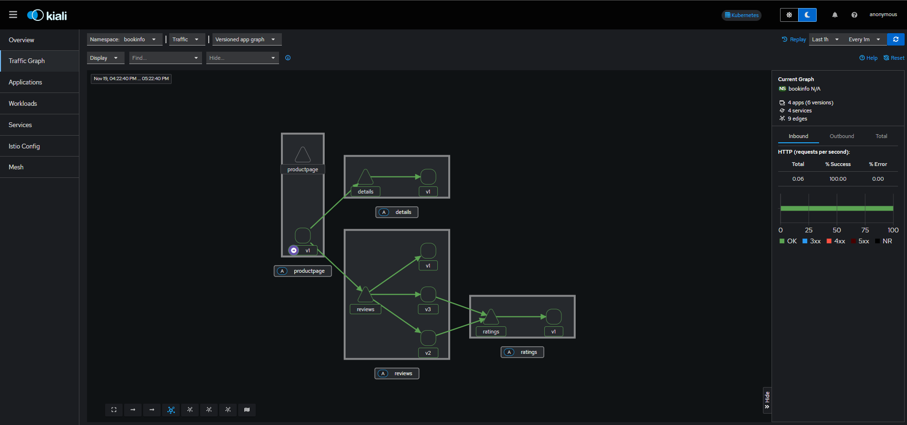

# Istio Traffic Management Lab - CKA Course

Este laboratorio práctico está diseñado para aprender a implementar estrategias de backup y restauración de etcd, un componente esencial en el control plane de Kubernetes. Asegúrate de seguir cada paso cuidadosamente y practicar varias veces para estar completamente preparado para el examen.

## Prerrequisitos

- **VirtualBox** (se necesita **Python** y **pywin32** como prerrequisitos).
- **Vagrant**.
- **MobaXterm** para sesiones SSH.

## Objetivos

1. Instalar y configurar Istio en un clúster de Kubernetes, habilitando la gestión de tráfico avanzada.
2. Activar la inyección de sidecars para gestionar el tráfico entre servicios.
3. Configurar un API Gateway de Istio para controlar el tráfico de entrada al clúster.
4. Aplicar reglas de **Request Routing** para dirigir el tráfico a versiones específicas de servicios.
5. Simular fallos mediante la **Fault Injection** (inyección de latencia y errores).
6. Implementar políticas de **Traffic Shifting** para dividir el flujo entre versiones.
7. Configurar **Circuit Breaking** para mejorar la estabilidad ante fallos.
8. Aplicar **Traffic Mirroring** para duplicar el tráfico hacia nuevas versiones para pruebas sin impacto en usuarios.
9. Configurar gateways de **Ingress y Egress** para gestionar tráfico externo.
10. Practicar técnicas básicas de solución de problemas en Istio.

## Contenido del Repositorio

Este repositorio incluye:

- Una carpeta `istio-manifests` que contiene archivos *IstioOperator* para instalar los *Ingress* y *Egress Gateway* de Istio.
- Una carpeta `scripts` con dos scripts que proporcionan soporte durante el laboratorio.
- Un fichero `Vagrantfile` que permite automatizar el despliegue de tres VMs en VirtualBox.

Las VMs consisten en:

- 1 nodo master.
- 2 nodos worker.

## Paso 1: Despliegue de las VMs

1. Clona el repositorio en tu entorno local:

   ```bash
   git clone https://github.com/arol-dev/kubernetes-cka-istio-traffic-management.git
   cd kubernetes-cka-istio-traffic-management
   ```

2. Dentro del repositorio, ejecuta el siguiente comando para desplegar las VMs:

   ```bash
   vagrant up
   ```

   Esto comenzará a desplegar tres VMs en VirtualBox: un nodo master y dos worker nodes. Espera unos minutos para que el proceso termine.

3. Verifica el estado de las VMs con:

   ```bash
   vagrant status
   ```

   Asegúrate de que las tres máquinas estén en estado `running`.

4. Obtén la configuración SSH para conectarte a las máquinas:

   ```bash
   vagrant ssh-config
   ```

   Guarda los detalles proporcionados, ya que los necesitarás en el siguiente paso.

## Paso 2: Conectar a las VMs con MobaXterm

1. Abre **MobaXterm** y utiliza la configuración SSH obtenida anteriormente para conectarte a las tres máquinas.
   - No se requiere un usuario específico, deja el campo vacío.
   - Si se te solicita usuario o contraseña, utiliza la cadena `vagrant`.

## Paso 3: Instalación de Istio

1. **Descargar Istio**
   ```bash
   curl -L https://istio.io/downloadIstio | sh -
   ```
2. **Actualizar PATH env**
   ```bash
   export PATH="$PATH:/home/vagrant/istio-1.24.0/bin"
   ```

3. **Pre-check de la Instalación de Istio**
   ```bash
   istioctl x precheck
   ```

4. **Instalar Istio Usando el Perfil Minimal**
   ```bash
   istioctl install --set profile=minimal -y --set meshConfig.accessLogFile=/dev/stdout
   ```
   `--set meshConfig.accessLogFile=/dev/stdout` habilita el registro de acceso (*access logging*) de Envoy Proxies. 

### Contenido del Directorio istio-1.24.0 Descargado

Este repositorio incluye:

- La carpeta `/samples/bookinfo/gateway-api`, que contiene todos los *manifests* para desplegar y gestionar el tráfico utilizando las APIs de Gateway de Kubernetes. Incluye la definición del Gateway y varias HTTPRoute para configurar la gestión del tráfico.

- La carpeta `/samples/bookinfo/networking`, que contiene todos los *manifests* para desplegar y gestionar el tráfico utilizando las APIs de Istio. Incluye la definición del Gateway de tipo `gateway.networking.istio.io` y varios VirtualService para configurar la gestión del tráfico.

## Paso 3: Habilitar Istio en el Clúster

1. **Habilitar la Inyección de Istio en el Namespace bookinfo e default**
   ```bash
   kubectl create ns bookinfo && \
   kubectl label namespace bookinfo istio-injection=enabled && \
   kubectl label namespace default istio-injection=enabled
   ```
2. **Verificar las etiquetas**

   Puedes comprobar si los namespaces están etiquetados correctamente con el siguiente comando:
   ```bash
   kubectl get namespace -L istio-injection
   ```

## Paso 4: Desplegar la Aplicación BookInfo de Istio

1. Despliega la aplicación:
   ```bash
   kubectl apply -f https://raw.githubusercontent.com/istio/istio/release-1.23/samples/bookinfo/platform/kube/bookinfo.yaml -n bookinfo
   ```

2. Verifica que los pods se hayan desplegado correctamente en el namespace bookinfo.
   ```bash
   kubectl get pods -n bookinfo
   ```

   Deberías ver que los pods muestran `READY 2/2`, lo que confirma que tienen su contenedor de aplicación y el contenedor *sidecar* de Istio.

3. Error: Si solo ves un contenedor por pod, reinicia el `coredns` (opcional):
   ```bash
   kubectl -n kube-system rollout restart deployment coredns
   ```

## Verificación de la aplicación BookInfo con Port-Forwarding desde el IDE (Visual Studio Code)

1. Expón la aplicación localmente. Desde el IDE, como Visual Studio Code (opcional):
   ```bash
   kubectl port-forward svc/productpage -n bookinfo 9080:9080
   ```
   Te recomiendo no cerrar este *port forwarding*, ya que podría ser interesante analizarlo o utilizarlo en el futuro.

2. Prueba la aplicación desde el navegador (opcional):
   - [http://127.0.0.1:9080/productpage](http://localhost:9080/productpage)

3. Si la aplicación se ve lenta o incorrecta, reinicia el `coredns` (opcional):
   ```bash
   kubectl -n kube-system rollout restart deployment coredns
   ```

## Paso 5: Instalar Kiali Istio Dashboard

Istio se integra con varias aplicaciones de telemetría que te ayudan a comprender la estructura de tu *service mesh*, mostrar su topología y analizar su estado de salud.
Sigue las instrucciones a continuación para desplegar el dashboard de Kiali, junto con Prometheus, Grafana y Jaeger.

1. Instala Kiali y los otros complementos, y espera a que se desplieguen. Ejecuta el siguiente comando en el Master Node:
```bash
kubectl apply -f samples/addons && \
kubectl rollout status deployment/kiali -n istio-system
```
2. Accede al dashboard de Kiali.

Usando la herramienta `istioctl` **(este comando no funciona desde VirtuslBox)**,

```bash
istioctl dashboard kiali
```
O ejecutando un port-forwarding del servicio Kiali, en tu IDE.

```bash
kubectl port-forward svc/kiali -n istio-system 20001:20001
```

Te recomiendo no cerrar este *port forwarding*, ya que podría ser interesante analizarlo o utilizarlo en el futuro.

En el menú de navegación izquierdo, selecciona *Graph* y, en el desplegable *Namespace*, selecciona *bookinfo*.

Para ver los datos en la Dashboard, debes enviar solicitudes a tu servicio. La cantidad de solicitudes depende de la tasa de muestreo de Istio y puede configurarse mediante la API de Telemetría. Con la tasa de muestreo predeterminada del 1%, necesitas enviar al menos 100 solicitudes antes de que el primer rastro sea visible. Para enviar 100 solicitudes al servicio `productpage`, utiliza el siguiente comando:

```bash
for i in $(seq 1 100); do curl -s -o /dev/null "http://127.0.0.1:9080/productpage"; done
```

Deberías ver la siguiente *service mesh* en tu dashboard de Kiali.



## Paso 6: Instalación de Ingress y Egress Controller en el Clúster

Para crear un entorno de *networking* más completo y eficiente, procederemos a instalar dos *IstioOperator* que configurarán los *pods* de *Networking* (por ejemplo, `istio-ingressgateway`) que serán utilizados por los *Gateways* en nuestro clúster. Estos componentes de *IstioOperator* se instalarán utilizando los *manifests* disponibles en la carpeta `istio-manifests`. Copia estos *manifests* a tu clúster y aplica los siguientes comandos para desplegarlos:

**IstioOperator para Ingress Gateway**  
```bash
istioctl install -f ingress.yaml
```

**IstioOperator para Egress Gateway**  
```bash
istioctl install -f egress.yaml
```

### Servicios Automáticos para Gateways

Istio crea automáticamente dos *services* (uno para el *Ingress Gateway* y otro para el *Egress Gateway*) que proporcionan acceso real de *networking* a los *Gateways*. Por defecto, el servicio de *Ingress* de Istio se configura como tipo *LoadBalancer*. Sin embargo, para trabajar en un entorno local, es necesario cambiar el tipo del servicio a *ClusterIP*. Para realizar este cambio, edita la configuración del servicio utilizando el siguiente comando:

```bash
# Modifica el tipo de svc desde LoadBalancer a ClusterIP
kubectl edit svc istio-ingressgateway -n istio-system
```

En el archivo de configuración que se abre, localiza la línea que contiene `type: LoadBalancer` y cámbiala a `type: ClusterIP`. Una vez realizados los cambios, guarda y cierra el editor para aplicarlos.

En la siguiente parte del laboratorio, optaremos por utilizar las `APIs de Istio` para configurar y gestionar el tráfico de manera avanzada. Dado que ya hemos integrado Istio, confiamos en sus funcionalidades para definir rutas y políticas de tráfico. El *Istio Gateway* es la opción más adecuada para este propósito.

Para completar la configuración, será necesario crear recursos de Istio como `Gateway` y `VirtualService`, que definirán las reglas de enrutamiento. Estos recursos se configuran utilizando los *manifests* disponibles en el directorio `/samples/bookinfo/networking` proporcionado por Istio.

Los *Gateways* utilizarán el tipo de recurso `gateway.networking.istio.io`, mientras que las reglas de enrutamiento estarán definidas en los recursos `VirtualService` y `DestinationRules`.

## Paso 7: Traffic Management

Esta sección explora cómo gestionar el flujo de tráfico entre servicios en un entorno Kubernetes usando Istio.

La gestión de tráfico en Istio (Traffic Management) es una funcionalidad avanzada que permite controlar cómo las solicitudes se enrutan y distribuyen entre los servicios dentro de un clúster de Kubernetes. Con Istio, es posible definir reglas detalladas para dirigir el tráfico, dividirlo entre diferentes versiones de un servicio (por ejemplo, para pruebas A/B o despliegues canary), simular fallos (latencia o errores), y gestionar el flujo de datos de entrada y salida del clúster.

Entre las capacidades clave de la gestión de tráfico en Istio están:

- Request Routing
- Fault Injection
- Traffic Shifting
- Circuit Breaking
- Mirroring
- Ingress Gateway
- Egress Gateway

## 7.1 Request Routing

#### Descripción:
El enrutamiento de solicitudes permite dirigir el tráfico a versiones específicas de un servicio según reglas, como encabezados HTTP, rutas de URL o porcentajes de tráfico. Es útil para implementaciones canary o pruebas A/B.

#### Ejemplo:
Notarás que a veces la salida de reseñas de libros contiene calificaciones con estrellas y otras veces no. Esto se debe a que, sin una versión de servicio predeterminada explícita para enrutar, Istio distribuye las solicitudes entre todas las versiones disponibles en un esquema de *round robin*.

El objetivo inicial de esta tarea es aplicar reglas que enruten todo el tráfico a la versión v1 de los microservicios. Más adelante, aplicarás una regla para enrutar el tráfico en función del valor de un encabezado HTTP en la solicitud.

Como primer paso, es necesario instalar un *Ingress Gateway*. Para desplegarlo, utilizaremos el siguiente *manifest* ubicado en el directorio correspondiente:

```bash
kubectl apply -f samples/bookinfo/networking/bookinfo-gateway.yaml -n bookinfo
```

Istio utiliza *subsets* en las *destination rules* para definir versiones de un servicio. Ejecuta el siguiente comando para crear reglas de destino (DestinationRule) predeterminadas para los servicios de Bookinfo:

```bash
kubectl apply -f samples/bookinfo/networking/destination-rule-all.yaml -n bookinfo
```

Espera unos segundos para que las reglas de destino se propaguen. Puedes ver las reglas de destino con el siguiente comando:

```bash
kubectl get destinationrules -n bookinfo -o yaml
```

Istio utiliza *virtual services* para definir reglas de enrutamiento. Ejecuta el siguiente comando para aplicar *virtual services* que enrutarán todo el tráfico a la versión v1 de cada microservicio:

```bash
kubectl apply -f samples/bookinfo/networking/virtual-service-all-v1.yaml -n bookinfo
```

#### Explicación: 
En este ejemplo, se aplican reglas de enrutamiento para el servicio Bookinfo. `destination-rule-all.yaml` define todas las versiones del servicio, mientras que `virtual-service-all-v1.yaml` dirige todo el tráfico a `reviews:v1`.

#### Resultado Esperado:
Todo el tráfico de los usuarios se dirige a `reviews:v1`, por lo que solo debería aparecer `reviews:v1` en las respuestas en Browser en la parte **Book Reviews**.

#### Verificación:
Puedes probar el comportamiento de la gestión de tráfico ejecutando los siguientes comandos:

1. Realiza un *port forward* del gateway (opcional si ya tienes el *forwarding* habilitado):

   ```bash
   kubectl port-forward svc/istio-ingressgateway -n istio-system 8080:80
   ```

2. Ejecuta un script que llama 6 veces al servicio `productpage` y muestra la información sobre las `reviews`:

   ```bash
   for i in {1..6}; do curl -s "http://localhost:8080/productpage" | grep -o "reviews-v.*"; done
   ```

## 7.2 Fault Injection (Inyección de Fallos)

#### Descripción:
La inyección de fallos permite simular problemas en el servicio, como latencia o errores, para probar la resiliencia de un sistema en condiciones no ideales.

#### Ejemplo:
Para probar la resiliencia de los microservicios de la aplicación Bookinfo, inyecta un retraso de 7 segundos entre los microservicios `reviews:v2` y `ratings` para el usuario *jason*. Esta prueba descubrirá un error que fue intencionadamente introducido en la aplicación Bookinfo.

Ten en cuenta que el servicio `reviews:v2` tiene un tiempo de espera de conexión codificado de 10 segundos para las llamadas al servicio `ratings`. Incluso con el retraso de 7 segundos que introdujiste, aún se espera que el flujo de extremo a extremo continúe sin errores.


Install la siguente VirtualService para que el trafico sea dirigido a `reviews:v2` para el usuario *jason*. 

```bash
kubectl apply -f samples/bookinfo/networking/virtual-service-reviews-test-v2.yaml -n bookinfo
```

Inyecta un retraso de 7 segundos entre los microservicios `reviews:v2` y `ratings` para el usuario *jason*

```bash
kubectl apply -f samples/bookinfo/networking/virtual-service-ratings-test-delay.yaml -n bookinfo
```
#### Explicación:
Este archivo aplica una regla que introduce un retraso de 7 segundos en las respuestas del servicio `ratings`, simulando latencia.

#### Resultado Esperado:
Al acceder a `productpage`, se notará un retraso en el servicio `ratings`, permitiendo observar los efectos de la latencia en los servicios dependientes.

#### Verificación:
Abre la aplicación web Bookinfo en tu navegador.

En la página web `/productpage`, inicia sesión como el usuario *jason*.

Se espera que la página de inicio de Bookinfo se cargue sin errores en aproximadamente 7 segundos. Sin embargo, hay un problema: la sección de *Reviews* muestra un mensaje de error:

> Sorry, product reviews are currently unavailable for this book.

Para ver los tiempos de respuesta de la página web:

1. Abre el menú de Herramientas para Desarrolladores en tu navegador.
2. Dirígete a la pestaña *Network*.
3. Recarga la página `/productpage`. Verás que la página en realidad se carga en unos 6 segundos.

Has encontrado un error. Existen tiempos de espera (*timeout*) codificados en los microservicios que han causado el fallo del servicio *reviews*.

Como se esperaba, el retraso de 7 segundos que introdujiste no afecta al servicio *reviews* porque el *timeout* entre los servicios *reviews* y *ratings* está fijado en 10 segundos. Sin embargo, también hay un *timeout* codificado entre el servicio *productpage* y el servicio *reviews*, establecido en 3 segundos más 1 nuevo intento, para un total de 6 segundos. Como resultado, la llamada de *productpage* a *reviews* expira prematuramente y genera un error después de 6 segundos.

## 7.3 Traffic Shifting o Despliegue Canary (Cambio de Tráfico)

#### Descripción:
El cambio de tráfico permite redirigir gradualmente el tráfico entre versiones de un servicio en proporciones específicas, útil para despliegues canary.

#### Ejemplo:
Ahora queremos dirigir el 50% del tráfico a `reviews:v1` y el 50% a `reviews:v3`. Luego, completarás la migración redirigiendo el 100% del tráfico a `reviews:v3`.

Install la siguente VirtualService para que todo el trafico sea dirigido a `reviews:v1`: 
```bash
kubectl apply -f samples/bookinfo/networking/virtual-service-all-v1.yaml -n bookinfo
```

Ejecuta un script que llama 6 veces al servicio `productpage` y muestra la información sobre las `reviews`:

```bash
for i in {1..6}; do curl -s "http://localhost:8080/productpage" | grep -o "reviews-v.*"; done
```

Deberias ver solo *reviews-v1-*

Install la siguente VirtualService para que el trafico sea dirigido el 50% a `reviews:v1` y el restante 50% a `reviews:v3`: 
```bash
kubectl apply -f samples/bookinfo/networking/virtual-service-reviews-50-v3.yaml -n bookinfo
```

**Ejecuta los pasos de verificación al final de esta sección de *traffic shifting*, en este momento, antes de continuar con el siguiente comando.**

Supongamos que el microservicio `reviews:v3` es estable, puedes enrutar el 100% del tráfico a `reviews:v3` aplicando este *virtual service*:

```bash
kubectl apply -f samples/bookinfo/networking/virtual-service-reviews-v3.yaml -n bookinfo
```

**Ejecuta los pasos de verificación al final de esta sección de *traffic shifting*. Ahora deberias ver solo *reviews-v3-***

#### Explicación:
Esta regla divide el tráfico entre `reviews:v1` y `reviews:v3` según una proporción definida. Modifica la configuración para probar diferentes divisiones de tráfico, como 50%-50%.

#### Resultado Esperado:
El tráfico hacia el servicio se dividirá entre `reviews:v1` y `reviews:v3`, y las respuestas deberían reflejar ambas versiones. Al final, todo el tráfico será dirigido a `reviews:v3`.

#### Verificación:
Actualiza la página `/productpage` en tu navegador y ahora verás las calificaciones con estrellas en color rojo aproximadamente el 50% de las veces. Esto se debe a que la versión `v3` de *reviews* accede al servicio de calificaciones con estrellas, mientras que la versión `v1` no lo hace.

Ejecuta un script que llama 6 veces al servicio `productpage` y muestra la información sobre las `reviews`:

```bash
for i in {1..6}; do curl -s "http://localhost:8080/productpage" | grep -o "reviews-v.*"; done
```

Deberias ver *reviews-v1-* y *reviews-v3-*. 

## 7.4 Circuit Breaking (Corte de Circuito)

#### Descripción:
El *circuit breaking* es un patrón fundamental para crear aplicaciones de microservicios resilientes. Este enfoque permite diseñar aplicaciones que minimicen el impacto de fallos, picos de latencia y otros efectos no deseados derivados de las peculiaridades de la red. Al limitar la cantidad de solicitudes que pueden pasar a un servicio en condiciones específicas, se previenen sobrecargas y se garantiza una mejor estabilidad del sistema.

En esta actividad, configurarás reglas de *circuit breaking* y posteriormente probarás la configuración activando deliberadamente el interruptor del circuito. Esto te permitirá observar cómo Istio gestiona escenarios de fallos y mantiene la resiliencia en tu *service mesh*.

#### Ejemplo:
La aplicación *httpbin* sirve como el servicio de backend para esta actividad. Para interactuar con este servicio, crearás un cliente llamado *fortio*, una herramienta de prueba de carga. *Fortio* te permitirá controlar el número de conexiones, la concurrencia y los retrasos en las llamadas HTTP salientes. Utilizarás este cliente para "activar" las políticas de *circuit breaking* que configures en el `DestinationRule`.

Desplega el servicio de backend httpbin:

```bash
kubectl apply -f samples/httpbin/httpbin.yaml
```

Crea un DestinationRule por el servicio de backend.
```yaml
kubectl apply -f - <<EOF
apiVersion: networking.istio.io/v1
kind: DestinationRule
metadata:
  name: httpbin
spec:
  host: httpbin
  trafficPolicy:
    connectionPool:
      tcp:
        maxConnections: 1
      http:
        http1MaxPendingRequests: 1
        maxRequestsPerConnection: 1
    outlierDetection:
      consecutive5xxErrors: 1
      interval: 1s
      baseEjectionTime: 3m
      maxEjectionPercent: 100
EOF
```

Inyecta el cliente con el *sidecar proxy* de Istio para que las interacciones de red sean gestionadas por Istio, despliega el servicio *fortio* con el siguiente comando:

```bash
kubectl apply -f samples/httpbin/sample-client/fortio-deploy.yaml
```

**Desde la terminal de VirtualBox**, inicia sesión en el *pod* del cliente y utiliza la herramienta *fortio* para hacer llamadas al servicio *httpbin*. Pasa `curl` como parámetro para indicar que solo deseas realizar una llamada:

```bash
kubectl exec -it <fortio-pod-name> -c fortio -- /usr/bin/fortio curl http://httpbin:8000/get
```

O puedes ejecutar estos comandos:

```bash
export FORTIO_POD=$(kubectl get pods -l app=fortio -o 'jsonpath={.items[0].metadata.name}') && \
kubectl exec "$FORTIO_POD" -c fortio -- /usr/bin/fortio curl -quiet http://httpbin:8000/get
```

En la configuración del `DestinationRule`, especificaste `maxConnections: 1` y `http1MaxPendingRequests: 1`. Estas reglas indican que, si excedes más de una conexión y una solicitud simultáneamente, deberías observar algunos fallos cuando el *istio-proxy* active el *circuit breaker* para bloquear solicitudes y conexiones adicionales.

Utilizamos el cliente *fortio* con dos conexiones concurrentes (`-c 2`) y enviamos 20 solicitudes (`-n 20`):

```bash
kubectl exec "$FORTIO_POD" -c fortio -- /usr/bin/fortio load -c 2 -qps 0 -n 20 -loglevel Warning http://httpbin:8000/get
```

Es interesante observar que casi todas las solicitudes fueron procesadas exitosamente. El *istio-proxy* permite cierta flexibilidad.

- **Código 200:** 17 (85.0 %)  
- **Código 503:** 3 (15.0 %)  

Esto indica que aunque las políticas de *circuit breaking* están configuradas, el proxy de Istio permite manejar algunas solicitudes adicionales antes de aplicar restricciones más estrictas.

Incrementa el número de conexiones concurrentes a 3:

```bash
kubectl exec "$FORTIO_POD" -c fortio -- /usr/bin/fortio load -c 3 -qps 0 -n 30 -loglevel Warning http://httpbin:8000/get
```

Ahora comienzas a observar el comportamiento esperado del *circuit breaking*. Solo el 36.7% de las solicitudes se procesaron con éxito, mientras que el resto fueron bloqueadas por el *circuit breaker*:

- **Código 200:** 11 (36.7 %)  
- **Código 503:** 19 (63.3 %)  

Esto confirma que las políticas configuradas están funcionando correctamente al limitar las solicitudes concurrentes según las reglas establecidas.

#### Explicación:
Este ejemplo configura un límite de conexiones concurrentes al servicio `httpbin` igual a 1. Esto significa que, cuando el servicio recibe más de una solicitud HTTP al mismo tiempo, el *sidecar proxy* de Istio redirige las solicitudes adicionales al *Circuit Breaker* y devuelve un error 503.  

Es muy interesante observar cómo el servicio sigue funcionando y respondiendo a algunas solicitudes HTTP, mientras que nuestro servicio está controlado por el *sidecar proxy*. Esto evita errores causados por picos de latencia y otros efectos no deseados derivados de las peculiaridades de la red.  

Al limitar la cantidad de solicitudes concurrentes, se previenen sobrecargas y se garantiza una mayor estabilidad para el sistema backend `httpbin`. Esto demuestra cómo el *Circuit Breaking* es una herramienta clave para mantener la resiliencia en sistemas distribuidos.

#### Resultado Esperado:
Puedes observar el comportamiento esperado del *circuit breaking*. Solo el 36.7% de las solicitudes se procesaron con éxito, mientras que el resto fueron bloqueadas por el *circuit breaker*:

- **Código 200:** 11 (36.7 %)  
- **Código 503:** 19 (63.3 %)  

#### Verificación:
Incrementa el número de conexiones concurrentes para observar un aumento en las solicitudes con código 503. Alternativamente, puedes establecer el número de conexiones en 1 para verificar que el backend responde con éxito a todas las solicitudes:

```bash
# Incrementa el número de conexiones concurrentes
kubectl exec -it <fortio-pod-name> -c fortio -- /usr/bin/fortio load -c <número_de_conexiones> -n <número_de_solicitudes> http://httpbin:8000

# Establece el número de conexiones en 1
kubectl exec "$FORTIO_POD" -c fortio -- /usr/bin/fortio load -c 1 -qps 0 -n 30 -loglevel Warning http://httpbin:8000/get
```

## 7.5 Mirroring

#### Descripción:
El *Traffic Mirroring*, también conocido como *shadowing*, es un concepto poderoso que permite a los equipos de desarrollo implementar cambios en producción con el menor riesgo posible. El mirroring envía una copia del tráfico en vivo a un servicio espejado. Este tráfico se gestiona fuera del flujo crítico de las solicitudes del servicio principal.

#### Ejemplo:
En esta actividad, primero forzarás que todo el tráfico vaya a la versión `v1` del servicio httbin. Luego, aplicarás una regla para espejar una porción del tráfico hacia la versión `v2` del mismo servicio de backend httbin.

### Limpieza del Entorno del Ejercicio Anterior
**Desde la terminal de VirtualBox**, para garantizar que el entorno esté limpio antes de continuar, elimina los recursos creados en el ejercicio anterior con los siguientes comandos:

```bash
kubectl delete destinationrule httpbin
kubectl delete -f samples/httpbin/sample-client/fortio-deploy.yaml
kubectl delete -f samples/httpbin/httpbin.yaml
```

Comienza desplegando dos versiones del servicio `httpbin` con el registro de accesos habilitado:

**Despliega `httpbin-v1`:**

```bash
kubectl create -f - <<EOF
apiVersion: apps/v1
kind: Deployment
metadata:
  name: httpbin-v1
spec:
  replicas: 1
  selector:
    matchLabels:
      app: httpbin
      version: v1
  template:
    metadata:
      labels:
        app: httpbin
        version: v1
    spec:
      containers:
      - image: docker.io/kennethreitz/httpbin
        imagePullPolicy: IfNotPresent
        name: httpbin
        command: ["gunicorn", "--access-logfile", "-", "-b", "0.0.0.0:80", "httpbin:app"]
        ports:
        - containerPort: 80
EOF

```

**Despliega `httpbin-v2`:**

```bash
kubectl create -f - <<EOF
apiVersion: apps/v1
kind: Deployment
metadata:
  name: httpbin-v2
spec:
  replicas: 1
  selector:
    matchLabels:
      app: httpbin
      version: v2
  template:
    metadata:
      labels:
        app: httpbin
        version: v2
    spec:
      containers:
      - image: docker.io/kennethreitz/httpbin
        imagePullPolicy: IfNotPresent
        name: httpbin
        command: ["gunicorn", "--access-logfile", "-", "-b", "0.0.0.0:80", "httpbin:app"]
        ports:
        - containerPort: 80
EOF
```

**Despliega un Service por las dos aplicaciones `httpbin`:**

```bash
kubectl create -f - <<EOF
apiVersion: v1
kind: Service
metadata:
  name: httpbin
  labels:
    app: httpbin
spec:
  ports:
  - name: http
    port: 8000
    targetPort: 80
  selector:
    app: httpbin
EOF
``` 

**Despliega un aplicacion `curl` que usarás para enviar solicitudes al servicio `httpbin`:**

```bash
kubectl create -f - <<EOF
apiVersion: apps/v1
kind: Deployment
metadata:
  name: curl
spec:
  replicas: 1
  selector:
    matchLabels:
      app: curl
  template:
    metadata:
      labels:
        app: curl
    spec:
      containers:
      - name: curl
        image: curlimages/curl
        command: ["/bin/sleep","3650d"]
        imagePullPolicy: IfNotPresent
EOF
```
**Creación de una política de enrutamiento predeterminada**  

Por defecto, Kubernetes equilibra la carga entre ambas versiones del servicio `httpbin`. En este paso, cambiarás ese comportamiento para que todo el tráfico se dirija a `v1`.  

**Crea una VirtulService y un DestinationRule del API Istio para dirigir todo el tráfico a `v1` del servicio:**  

```bash
kubectl apply -f - <<EOF
apiVersion: networking.istio.io/v1
kind: VirtualService
metadata:
  name: httpbin
spec:
  hosts:
  - httpbin
  http:
  - route:
    - destination:
        host: httpbin
        subset: v1
      weight: 100

---
apiVersion: networking.istio.io/v1
kind: DestinationRule
metadata:
  name: httpbin
spec:
  host: httpbin
  subsets:
  - name: v1
    labels:
      version: v1
  - name: v2
    labels:
      version: v2
EOF
```  

Este manifiesto define un `VirtualService` que enruta todas las solicitudes al subset `v1` del servicio `httpbin`. Ahora, con todo el tráfico dirigido a `httpbin:v1`, envía una solicitud al servicio:

```bash
kubectl exec deploy/curl -c curl -- curl -sS http://httpbin:8000/headers
```

Esto enviará una solicitud HTTP al servicio `httpbin` en el puerto `8000`, devolviendo los encabezados de la solicitud procesados por la versión `v1` del servicio.

Verifica los logs de los pods `httpbin-v1` y `httpbin-v2`. Deberías ver entradas de registro de acceso para `v1` y ninguna para `v2`:

1. **Revisar los logs del pod `httpbin-v1`:**

   ```bash
   kubectl logs deploy/httpbin-v1 -c httpbin
   ```

2. **Revisar los logs del pod `httpbin-v2`:**

   ```bash
   kubectl logs deploy/httpbin-v2 -c httpbin
   ```

   Aquí deberías verificar que no hay registros de acceso procesados por `httpbin-v2`.

**Espejar tráfico a `httpbin-v2`**  

Modifica la regla de enrutamiento para espejar el tráfico hacia `httpbin-v2`. Aplica la siguiente configuración:  

```bash
kubectl apply -f - <<EOF
apiVersion: networking.istio.io/v1
kind: VirtualService
metadata:
  name: httpbin
spec:
  hosts:
  - httpbin
  http:
  - route:
    - destination:
        host: httpbin
        subset: v1
      weight: 100
    mirror:
      host: httpbin
      subset: v2
    mirrorPercentage:
      value: 100.0

EOF
```  

Esta regla enruta todo el tráfico al subset `v1` del servicio `httpbin` y, al mismo tiempo, crea un espejo de las solicitudes hacia `v2`. El tráfico espejado no afecta el flujo principal de la solicitud, pero permite monitorear cómo `v2` manejaría las mismas solicitudes.

Envía el tráfico:

```bash
kubectl exec deploy/curl -c curl -- curl -sS http://httpbin:8000/headers
```

#### Explicación:
Esta configuración espeja el 100% del tráfico de `httpbin:v1` a `httpbin:v2`, lo que permite probar `v2` sin afectar el flujo principal de los usuarios.

#### Resultado Esperado:
El 100% de las solicitudes HTTP enviadas a `httpbin:v1` serán recibidas como tráfico espejado por la aplicación `httpbin:v2`.

#### Verificación:
Envía el tráfico:

```bash
kubectl exec deploy/curl -c curl -- curl -sS http://httpbin:8000/headers
```
Revisar los logs del pod `httpbin-v1`:

```bash
kubectl logs deploy/httpbin-v1 -c httpbin
```

Revisar los logs del pod `httpbin-v2`:

```bash
kubectl logs deploy/httpbin-v2 -c httpbin
```

Ahora deberías ver registros de acceso tanto para `v1` como para `v2`. Los registros de acceso creados en `v2` corresponden a las solicitudes espejadas que en realidad están siendo procesadas por `v1`.

## 7.6 Ingress Gateway

#### Descripción:
El Ingress Gateway de Istio es un recurso que permite gestionar y controlar el tráfico entrante a un clúster de Kubernetes desde fuera del *service mesh*. A diferencia del recurso Ingress estándar de Kubernetes, el Gateway de Istio ofrece mayor flexibilidad y capacidades avanzadas, como la aplicación de políticas de enrutamiento, autenticación, monitoreo y balanceo de carga. Este recurso actúa como un punto de entrada que integra el tráfico externo con las aplicaciones distribuidas dentro del clúster, aprovechando las funciones de Istio para asegurar y optimizar las comunicaciones.

#### Ejemplo:
Esta tarea describe cómo configurar Istio para exponer un servicio fuera del *service mesh* utilizando un Gateway.

### Limpieza del Entorno del Ejercicio Anterior
Para garantizar que el entorno esté limpio antes de continuar, elimina los recursos creados en el ejercicio anterior con los siguientes comandos:

Elimina las reglas:
```bash
kubectl delete virtualservice httpbin
kubectl delete destinationrule httpbin
```

Elimina los despliegues httpbin y curl, así como el servicio httpbin:
```bash
kubectl delete deploy httpbin-v1 httpbin-v2 curl
kubectl delete svc httpbin
```

Inicia el ejemplo `httpbin`, que servirá como servicio de destino para el *ingress traffic*:

```bash
kubectl apply -f samples/httpbin/httpbin.yaml
```

Creacion del Ingress Gateway: 

```bash
kubectl apply -f - <<EOF
apiVersion: networking.istio.io/v1
kind: Gateway
metadata:
  name: httpbin-gateway
spec:
  # The selector matches the ingress gateway pod labels.
  # If you installed Istio using Helm following the standard documentation, this would be "istio=ingress"
  selector:
    istio: ingressgateway
  servers:
  - port:
      number: 80
      name: http
      protocol: HTTP
    hosts:
    - "httpbin.example.com"
EOF
```
Aplica un VirtualService para definir las reglas de enrutamiento del tráfico de entrada:

```bash
kubectl apply -f - <<EOF
apiVersion: networking.istio.io/v1
kind: VirtualService
metadata:
  name: httpbin
spec:
  hosts:
  - "httpbin.example.com"
  gateways:
  - httpbin-gateway
  http:
  - match:
    - uri:
        prefix: /status
    - uri:
        prefix: /delay
    route:
    - destination:
        port:
          number: 8000
        host: httpbin
EOF
```
Ahora has creado una configuración de *virtual service* para el servicio `httpbin`, que contiene dos reglas de enrutamiento que permiten el tráfico para las rutas `/status` y `/delay`.

El *gateways* especifica que solo se permiten las solicitudes que pasen a través de tu `httpbin-gateway`. Todas las demás solicitudes externas serán rechazadas con una respuesta 404.

Cada Ingress Gateway está respaldado por un servicio de tipo *LoadBalancer*. **La IP del balanceador de carga externo y los puertos de este servicio se utilizan para acceder al Gateway**. En nuestro entorno de desarrollo, el servicio de tipo *LoadBalancer* ya existe, pero se ha convertido en tipo *ClusterIP* para funcionar en un entorno local. Este servicio se llama `istio-ingressgateway` y fue configurado al inicio de este laboratorio (IstioOperator).

Para acceder a nuestra aplicación en un entorno local, desde nuestro IDE debemos habilitar un *Port Forwarding* para el `istio-ingressgateway`:

```bash
kubectl port-forward svc/istio-ingressgateway -n istio-system 9000:80
```

Ejecuta la solicitud HTTP con el *hostname* como *header*:

```bash
curl -s -I -HHost:httpbin.example.com "http://127.0.0.1:9000/status/200"
```

Deberías recibir una respuesta HTTP desde la aplicación *httpbin*.

Ejecuta una segunda solicitud HTTP hacia una ruta que no está definida en el *VirtualService*:

```bash
curl -s -I -HHost:httpbin.example.com "http://127.0.0.1:9000/headers"
```

Deberías recibir una respuesta HTTP: **HTTP/1.1 404 Not Found**.

#### Explicación:


Hemos desplegado una aplicación *httpbin* que escucha en el puerto 8000 y definido un servicio *httpbin* para servir los pods. Posteriormente, configuramos un *gateway* que habilita el *hostname* `httpbin.example.com` y el puerto 80 sobre el servicio `istio-ingressgateway`, que opera de manera similar a un *ingress-controller* de Kubernetes. Finalmente, mediante la definición de la *VirtualService*, establecimos las rutas y el servicio encargado de responder a las solicitudes HTTP que llegan al *gateway* `httpbin-gateway`.

Para verificar que nuestra configuración era correcta, activamos un *port-forwarding* del servicio `istio-ingressgateway`. Esto se debe a que, para acceder al *Gateway*, normalmente se utilizan la IP del balanceador de carga externo y los puertos de este servicio. Sin embargo, en nuestro entorno, el servicio se ha modificado al tipo *ClusterIP* y se llama `istio-ingressgateway`.


#### Resultado Esperado:
Después de habilitar el *port forwarding*, la aplicación responde correctamente a las solicitudes realizadas sobre las rutas `/status` y `/delay`, definidas en el *VirtualService*. Por otro lado, responde con un error **404 Not Found** para las rutas no definidas en el *VirtualService*.

#### Verificación:

Aquí tienes los comandos `kubectl get` para verificar los recursos desplegados en el clúster:

1. **Obtener los Gateways Istio configurados:**
   ```bash
   kubectl get gateway
   ```

2. **Obtener los servicios (Service) del namespace:**
   ```bash
   kubectl get svc -n istio-system
   kubectl get svc
   ```

3. **Obtener los pods desplegados por Httpbin:**
   ```bash
   kubectl get pods
   ```

4. **Obtener los VirtualServices configurados:**
   ```bash
   kubectl get virtualservice
   ```

Para enviar múltiples solicitudes HTTP, puedes utilizar el siguiente comando:

```bash
for i in {1..6}; do curl -s -I -HHost:httpbin.example.com "http://127.0.0.1:9000/status/200"; done
```

### BookInfo (Opcional)

Es interesante analizar la configuración de Bookinfo con su propio *IngressGateway* desplegado en el namespace `bookinfo`.

1. **Verificar la presencia de un Gateway en el namespace `bookinfo`**  
   Utiliza el siguiente comando para comprobar que el Gateway está configurado:

   ```bash
   kubectl get gateway -n bookinfo
   ```

2. **Analizar el contenido del Gateway**  
   Inspecciona la configuración del Gateway con el siguiente comando:

   ```bash
   kubectl get gateway bookinfo-gateway -n bookinfo -o yaml
   ```

3. **Exponer la aplicación localmente**  
   Desde el IDE, como Visual Studio Code (opcional), expón la aplicación utilizando el *bookinfo-gateway*:

   ```bash
   kubectl port-forward svc/istio-ingressgateway -n istio-system 8080:80
   ```

   **Nota:** Te recomiendo no cerrar este *port forwarding*, ya que podría ser interesante analizarlo o utilizarlo en el futuro.

4. **Probar la aplicación desde el navegador (opcional)**  
   Accede a la aplicación Bookinfo en tu navegador:

   - [http://127.0.0.1:8080/productpage](http://localhost:8080/productpage)

   Deberías poder acceder a la aplicación Bookinfo sin problemas.

5. **Analizar la aplicación en el Dashboard de Kiali**  
   Observa la configuración de la aplicación en el dashboard de Kiali. Deberías ver una estructura como la siguiente:

    

## 7.6 Egress Gateway

#### Descripción:
El Ingress Gateway de Istio es un recurso que permite gestionar y controlar el tráfico entrante a un clúster de Kubernetes desde fuera del *service mesh*. A diferencia del recurso Ingress estándar de Kubernetes, el Gateway de Istio ofrece mayor flexibilidad y capacidades avanzadas, como la aplicación de políticas de enrutamiento, autenticación, monitoreo y balanceo de carga. Este recurso actúa como un punto de entrada que integra el tráfico externo con las aplicaciones distribuidas dentro del clúster, aprovechando las funciones de Istio para asegurar y optimizar las comunicaciones.

#### Ejemplo:
En este laboratorio, configuramos un Egress Gateway en Istio para permitir y gestionar el tráfico saliente hacia un servicio externo (en este caso, edition.cnn.com). Esta configuración permite aplicar políticas de seguridad, control y observabilidad al tráfico externo.

### Limpieza del Entorno del Ejercicio Anterior
Para garantizar que el entorno esté limpio antes de continuar, elimina los recursos creados en el ejercicio anterior con los siguientes comandos:

```bash
kubectl delete gateway httpbin-gateway
kubectl delete virtualservice httpbin
kubectl delete --ignore-not-found=true -f samples/httpbin/httpbin.yaml
```

Despliega la aplicación de ejemplo *curl* para usarla como fuente de prueba para enviar solicitudes.

```bash
kubectl apply -f samples/curl/curl.yaml
```

**Configura y verifica el tráfico de salida utilizando Istio Egress Gateway**

Configura la variable de entorno `SOURCE_POD` con el nombre de tu pod curl:

```bash
export SOURCE_POD=$(kubectl get pod -l app=curl -o jsonpath={.items..metadata.name})
```

Define un `ServiceEntry` para `edition.cnn.com`. Especifica el puerto 443 con protocolo TLS en el `ServiceEntry` y en el Gateway de Egress.

```bash
kubectl apply -f - <<EOF
apiVersion: networking.istio.io/v1
kind: ServiceEntry
metadata:
  name: cnn
spec:
  hosts:
  - edition.cnn.com
  ports:
  - number: 443
    name: tls
    protocol: TLS
  resolution: DNS
EOF
```

Verifica que el `ServiceEntry` se aplicó correctamente enviando una solicitud HTTP a `https://edition.cnn.com/politics`:

```bash
kubectl exec "$SOURCE_POD" -c curl -- curl -sSL -o /dev/null -D - https://edition.cnn.com/politics
```

Crea un Egress Gateway para `edition.cnn.com` y reglas de enrutamiento para dirigir el tráfico a través del Egress Gateway y hacia el servicio externo:

```bash
kubectl apply -f - <<EOF
apiVersion: networking.istio.io/v1
kind: Gateway
metadata:
  name: istio-egressgateway
spec:
  selector:
    istio: egressgateway
  servers:
  - port:
      number: 443
      name: tls
      protocol: TLS
    hosts:
    - edition.cnn.com
    tls:
      mode: PASSTHROUGH
---
apiVersion: networking.istio.io/v1
kind: DestinationRule
metadata:
  name: egressgateway-for-cnn
spec:
  host: istio-egressgateway.istio-system.svc.cluster.local
  subsets:
  - name: cnn
EOF
```

Configura las reglas de enrutamiento para dirigir el tráfico desde los sidecars al Egress Gateway y del Egress Gateway al servicio externo:

```bash
kubectl apply -f - <<EOF
apiVersion: networking.istio.io/v1
kind: VirtualService
metadata:
  name: direct-cnn-through-egress-gateway
spec:
  hosts:
  - edition.cnn.com
  gateways:
  - mesh
  - istio-egressgateway
  tls:
  - match:
    - gateways:
      - mesh
      port: 443
      sniHosts:
      - edition.cnn.com
    route:
    - destination:
        host: istio-egressgateway.istio-system.svc.cluster.local
        subset: cnn
        port:
          number: 443
  - match:
    - gateways:
      - istio-egressgateway
      port: 443
      sniHosts:
      - edition.cnn.com
    route:
    - destination:
        host: edition.cnn.com
        port:
          number: 443
EOF
```

Envía una solicitud HTTPS a `https://edition.cnn.com/politics`:

```bash
kubectl exec "$SOURCE_POD" -c curl -- curl -sSL -o /dev/null -D - https://edition.cnn.com/politics
```

El resultado debería ser el mismo que en el paso anterior.

#### Explicación:

Definimos un `ServiceEntry` para permitir el tráfico hacia el servicio externo, configuramos un Egress Gateway para enrutar el tráfico utilizando TLS y aplicamos un `VirtualService` para dirigir el tráfico a través del Gateway.  

#### Resultado Esperado:

Las solicitudes a `https://edition.cnn.com/politics` se realizaron con éxito. Los logs del Egress Gateway confirmaron que el tráfico saliente fue gestionado por Istio.  

#### Verificación:

Verifica el registro del pod del Egress Gateway para encontrar una línea correspondiente a nuestra solicitud. Si Istio está desplegado en el namespace `istio-system`, utiliza el siguiente comando para imprimir el registro:

```bash
kubectl logs -l istio=egressgateway -c istio-proxy -n istio-system | tail
``` 

Esto mostrará las últimas líneas del registro del contenedor `istio-proxy` en el pod del Egress Gateway, donde deberías ver la solicitud realizada hacia `edition.cnn.com`.

## Troubleshooting Envoy Proxy Sidecar
Para solucionar problemas, inspecciona los registros del contenedor *sidecar* en los pods con Istio inyectado utilizando los siguientes comandos:

1. **Listar los pods en el namespace:**
   ```bash
   kubectl get pods -n <namespace>
   ```

2. **Inspeccionar los registros del contenedor `istio-proxy` (sidecar):**
   ```bash
   kubectl logs <nombre-del-pod> -c istio-proxy -n <namespace>
   ```

3. **Ver los últimos registros en tiempo real:**
   ```bash
   kubectl logs -f <nombre-del-pod> -c istio-proxy -n <namespace>
   ```

4. **Buscar errores específicos en los registros:**
   ```bash
   kubectl logs <nombre-del-pod> -c istio-proxy -n <namespace> | grep "error"
   ```

5. **Describir el pod para verificar la configuración de Istio:**
   ```bash
   kubectl describe pod <nombre-del-pod> -n <namespace>
   ```

Estos comandos te permitirán identificar y solucionar problemas relacionados con el *sidecar proxy* de Istio. Asegúrate de reemplazar `<nombre-del-pod>` y `<namespace>` con los valores correspondientes en tu entorno.